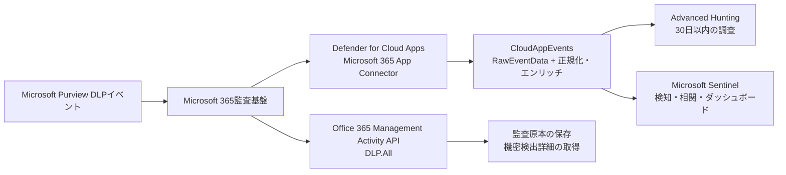
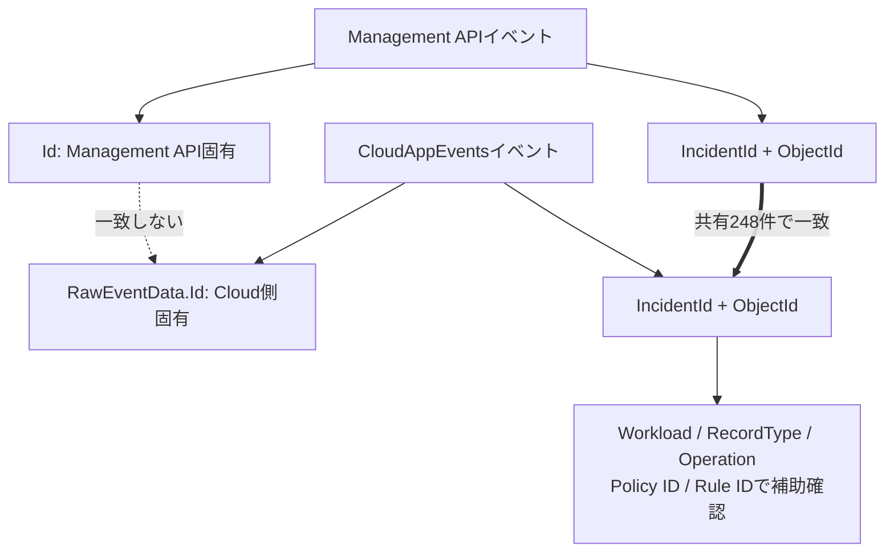
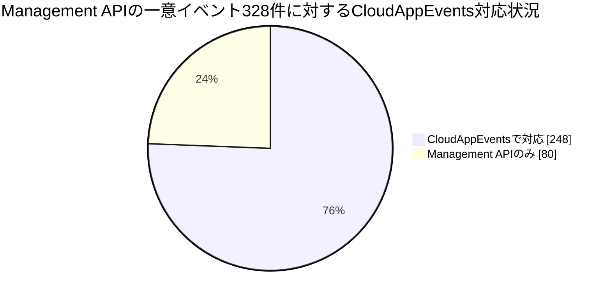
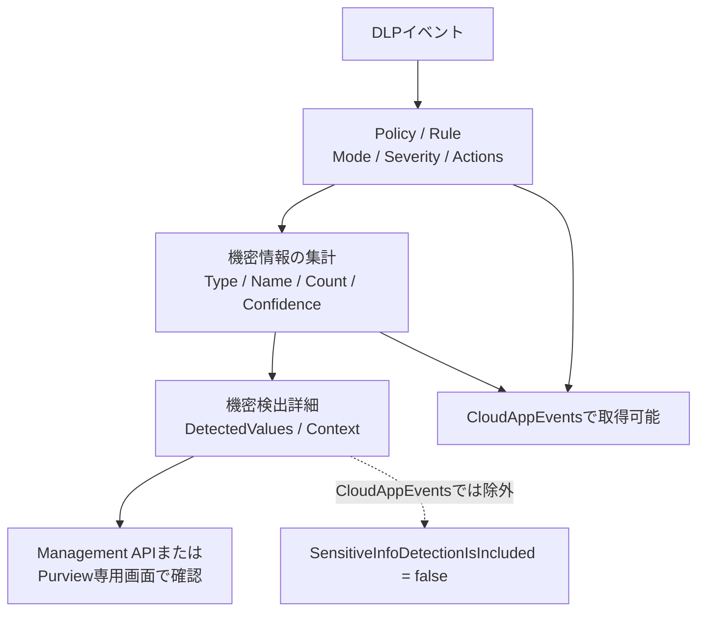
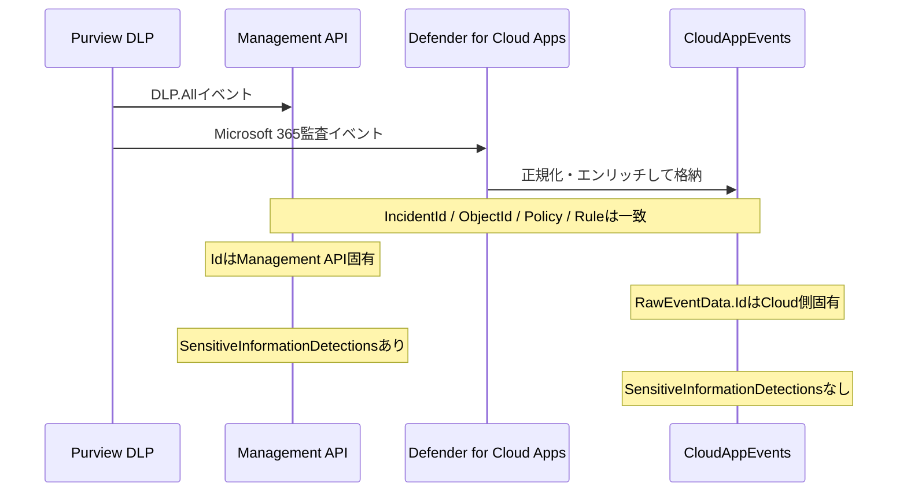
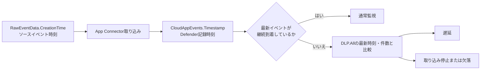
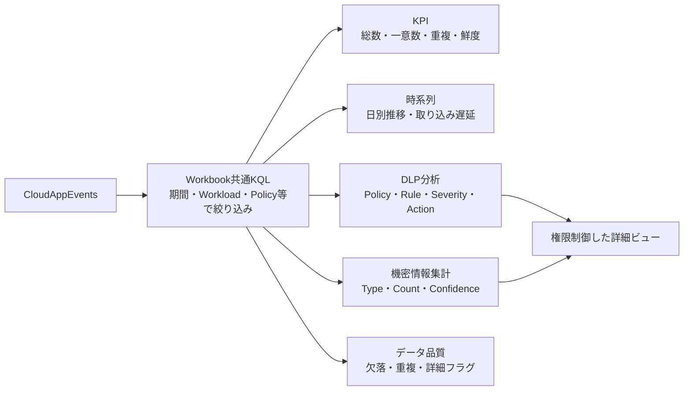
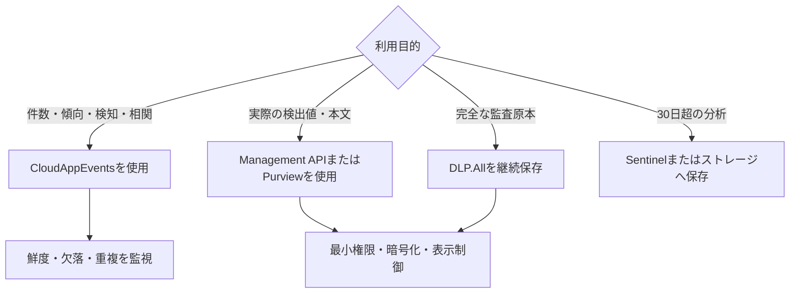

# Office 365 Management API `DLP.All` と CloudAppEvents の調査比較結果

## 1. エグゼクティブサマリー

Microsoft Defender XDRの`CloudAppEvents`から、Office 365 Management Activity APIの`DLP.All`に相当するExchangeおよびSharePointのDLPイベントを取得できることを、公式仕様と実テナントの両方で確認した。

共有イベントでは、次の分析情報が一致した。

- Workload、Operation、RecordType
- DLP Policy ID / Name
- DLP Rule ID / Name、RuleMode、Severity、Actions
- 機密情報タイプ、検出件数、信頼度
- Exchange / SharePointの対象メタデータ
- OrganizationId、UserId、UserKey

ただし、CloudAppEventsは`DLP.All`の完全な代替ではない。

1. Management APIで取得できた一意イベント328件のうち、同時点のCloudAppEventsで対応を確認できたのは248件（75.61%）だった。
2. Management APIだけに存在した80件は、CloudAppEventsの最終イベントより後の連続した時間帯に集中していた。取り込み遅延または停止と考えられるが、後日すべて反映されることは未確認。
3. Management APIでは取得できた実際の検出値と本文コンテキストが、CloudAppEventsでは除外されていた。
4. 両ソースの`Id`は一致しない。対応付けには`IncidentId`と`ObjectId`を使用する。
5. Advanced Huntingの調査範囲は最大30日であり、監査原本や長期保存先としては利用できない。

したがって、CloudAppEventsはDLPの傾向分析、アラート検知、セキュリティログとの相関分析には有効だが、完全な監査証跡、機密検出値の調査、長期保存には`DLP.All`またはPurviewの専用機能を併用する必要がある。

### 全体像



同じDLPイベントを起点としていても、`DLP.All`は監査フィード、CloudAppEventsはDefender for Cloud Appsを経由した検索・分析向けデータである。この経路の違いにより、イベントID、到着時刻、機密検出詳細に差が生じる。

## 2. 調査方法

### 2.1 Office 365 Management Activity API

- Content type: `DLP.All`
- Subscription status: `enabled`
- 取得範囲: APIで取得可能だった直近7日分
- Content blobs: 27
- Blob取得成功: 27/27
- 認証: OAuth 2.0 client credentials flow
- DLP機密詳細を読み取るApplication permissionを付与

### 2.2 CloudAppEvents

- Microsoft Graph Security API:
  `POST https://graph.microsoft.com/v1.0/security/runHuntingQuery`
- Application permission: `ThreatHunting.Read.All`
- 対象テーブル: `CloudAppEvents`
- 比較時刻: Management APIの`CreationTime`をUTCとして扱い、Cloud側の`RawEventData.CreationTime`と比較
- Operation比較: 大文字小文字を区別しない`in~`を使用

### 2.3 比較キー

実測ではManagement APIの`Id`とCloud側の`RawEventData.Id`が一致しなかったため、次のキーを使用した。

1. `IncidentId`
2. `ObjectId`
3. Workload / RecordType / Operation
4. 必要に応じてPolicy ID、Rule ID、対象メタデータ



`Id`は各ソース内の重複排除には使えるが、ソース間の結合キーにはできない。クロスソース比較では`IncidentId`と`ObjectId`を中心に、DLP分類情報を補助条件として使う。

## 3. Office 365 Management APIとCloudAppEventsの実測比較結果

### 3.1 件数

| 項目 | Management API | CloudAppEvents | 判定 |
| --- | ---: | ---: | --- |
| 取得行数 | 340 | 248 | Management側に重複12行 |
| 一意イベント | 328 | 248 | `IncidentId`基準で248件対応 |
| Exchange | 164一意 | 124 | 40件がManagement側のみ |
| SharePoint | 164一意 | 124 | 40件がManagement側のみ |
| Cloud側のみ | - | 0 | 該当なし |
| 対応率 | 328件中248件 | - | 75.61% |



円グラフの80件は特定のPolicyやWorkloadだけに偏った欠落ではない。ExchangeとSharePointに各40件あり、CloudAppEventsの最終到着時刻より後に連続していた。

Management APIだけに存在した80件は、次の時間帯に集中していた。

| Workload | 件数 | 最初のイベント（UTC） | 最後のイベント（UTC） |
| --- | ---: | --- | --- |
| Exchange | 40 | 2026-08-18 04:42:39 | 2026-08-19 19:42:52 |
| SharePoint | 40 | 2026-08-18 04:42:57 | 2026-08-19 19:43:03 |

CloudAppEventsの最終イベントは、Exchangeが2026-08-18 03:42:39 UTC、SharePointが2026-08-18 03:42:45 UTCだった。カテゴリ単位の欠落ではなく、特定時刻以降の取り込みが止まっている形だった。

### 3.2 過去30日のCloudAppEvents

| Workload | Operation | RecordType | 行数 | 一意なRaw ID |
| --- | --- | ---: | ---: | ---: |
| Exchange | `DlpRuleMatch` | 13 | 677 | 673 |
| SharePoint | `DLPRuleMatch` | 11 | 677 | 674 |

SharePointのOperationは`DLPRuleMatch`と表記されていた。KQLの`in`は大文字小文字を区別するため、`in~`または`=~`を使わないとSharePointイベントを見落とす。

### 3.3 共有248イベントの一致結果

| フィールド | 結果 |
| --- | --- |
| `Id` | 0/248一致。ソース間で別の値 |
| `IncidentId` | 248/248一致 |
| `ObjectId` | 248/248一致 |
| Operation / RecordType / Workload | 248/248一致 |
| OrganizationId / UserId / UserKey | 248/248一致 |
| Policy ID / Name | 248/248一致 |
| Rule ID / Name / Mode / Severity / Actions | 248/248一致 |
| SensitiveType / Name / Count / Confidence | 248/248一致 |
| ExchangeMetaData | Exchange 124/124一致 |
| SharePointMetaData | SharePoint 124/124一致 |
| CreationTime | 230/248一致。18件はCloud側が1秒早い |

共有イベントでは、トップレベル18項目の存在有無が両ソースで一致した。階層内でCloud側から一貫して除外されていた項目は`SensitiveInformationDetections`だった。

## 4. CloudAppEventsでできないこと

### 4.1 実際の検出値と本文コンテキストの取得

`DLP.All`では、必要な権限がある場合、DLPルールへ実際に一致した文字列と、その前後の本文を取得できる。

- 検出値: カード番号、口座番号、個人番号、メールアドレス、カスタムキーワードなど
- 本文コンテキスト: 検出値を含むメール本文または文書本文の抜粋
- `ResultsTruncated`: 検出結果が多く、一部が省略されたか

今回の実測:

| 項目 | Management API | CloudAppEvents |
| --- | ---: | ---: |
| `SensitiveInfoDetectionIsIncluded=True` | 340/340 | 0/248 |
| `SensitiveInfoDetectionIsIncluded=False` | 0/340 | 248/248 |
| `SensitiveInformationDetections` | 共有248件すべて | 0/248 |

CloudAppEventsで分かるのは「どの機密情報タイプが何件、どの信頼度で検出されたか」までであり、実際に一致した文字列は分からない。

### 4.2 検出値の具体例

以下は、評価用デモテナント`464ded72-1950-4150-8811-b47ceb718344`から実際に取得した同一DLPイベントの比較結果である。`IncidentId`でManagement APIとCloudAppEventsを対応付けた。テスト用データのため、検出値と本文コンテキストを省略せず掲載する。

#### Office 365 Management Activity API `DLP.All`の実データ

```json
{
  "CreationTime": "2026-08-15T14:42:20",
  "Id": "f1bac03b-7b07-4b0d-9468-ef03fff8f1bf",
  "IncidentId": "326c248c-1eda-8824-9800-08defadde0d5",
  "ObjectId": "<LV8PR13MB66346C1BF5B1808F0DBB3EFBCCD92@LV8PR13MB6634.namprd13.prod.outlook.com>",
  "Operation": "DlpRuleMatch",
  "RecordType": 13,
  "Workload": "Exchange",
  "UserId": "admin@azurecsa.net",
  "UserKey": "3fec1f5c-30e8-4f85-a30a-e5974f7d4653",
  "ExchangeMetaData": {
    "From": "admin@azurecsa.net",
    "To": [
      "admin@azurecsa.net"
    ],
    "MessageID": "<LV8PR13MB66346C1BF5B1808F0DBB3EFBCCD92@LV8PR13MB6634.namprd13.prod.outlook.com>",
    "RecipientCount": 1,
    "Sent": "2026-08-15T14:42:17",
    "Subject": "DLP Simulation Test - 2026-08-15 14:42:16 UTC",
    "UniqueID": "f44211b8-2712-4a2d-e77d-08defadb676d"
  },
  "PolicyDetails": [
    {
      "PolicyId": "1cbbbd37-57de-4883-bed3-e82be0c346ac",
      "PolicyName": "DLP Test - Credit Card Detection",
      "Rules": [
        {
          "RuleId": "c7c7ab3e-de13-4439-bd01-7e1766522954",
          "RuleName": "DLP Test Rule - Credit Card Low Count",
          "RuleMode": "Enable",
          "Severity": "Low",
          "Actions": [
            "GenerateAlert"
          ],
          "ConditionsMatched": {
            "SensitiveInformation": [
              {
                "ClassifierType": "None",
                "Confidence": 85,
                "Count": 1,
                "Location": "Message Body",
                "SensitiveInformationDetailedClassificationAttributes": [
                  {
                    "Confidence": 65,
                    "Count": 1,
                    "IsMatch": false
                  },
                  {
                    "Confidence": 75,
                    "Count": 1,
                    "IsMatch": true
                  },
                  {
                    "Confidence": 85,
                    "Count": 1,
                    "IsMatch": true
                  }
                ],
                "SensitiveInformationDetections": {
                  "DetectedValues": [
                    {
                      "Name": "4111 1111 1111 1111",
                      "Value": "ic App\r\nTimestamp: 2026-08-15 14:42:16 UTC\r\n\r\nTest Credit Card Numbers (Luhn-valid):\r\n  Visa:       4111 1111 1111 1111\r\n  Mastercard: 5500 0000 0000 0004\r\n  Amex:       3400 000000 00009\r\n  Discover:   6011 0000 0000 0"
                    }
                  ],
                  "ResultsTruncated": false
                },
                "SensitiveInformationTypeName": "Credit Card Number",
                "SensitiveType": "50842eb7-edc8-4019-85dd-5a5c1f2bb085",
                "UniqueCount": 1
              }
            ]
          }
        }
      ]
    }
  ],
  "SensitiveInfoDetectionIsIncluded": true
}
```

この実データでは、`DetectedValues[0].Name`に実際に検出された値`4111 1111 1111 1111`が入り、`DetectedValues[0].Value`にその前後のメール本文が入っていた。本文には同じテストメール内のMastercard、Amex、Discoverのテスト番号も含まれている。`ResultsTruncated=false`なので、この検出詳細は件数超過によって切り詰められていない。

公式スキーマは検出値とコンテキストをName/Valueペアとして定義している。実際のJSONでは、`Name`が検出値、`Value`が本文コンテキストという形で格納されていた。

#### 対応するCloudAppEvents Advanced Huntingクエリ

```kusto
let TargetIncidentId = "326c248c-1eda-8824-9800-08defadde0d5";
CloudAppEvents
| where Timestamp > ago(30d)
| extend RawData = todynamic(RawEventData)
| where tostring(RawData.IncidentId) == TargetIncidentId
| mv-expand Policy = RawData.PolicyDetails
| mv-expand Rule = Policy.Rules
| mv-expand SensitiveInfo = Rule.ConditionsMatched.SensitiveInformation to typeof(dynamic)
| project Timestamp,
    ReportId,
    RawId=tostring(RawData.Id),
    RawCreationTime=todatetime(RawData.CreationTime),
    IncidentId=tostring(RawData.IncidentId),
    ObjectId=tostring(RawData.ObjectId),
    Operation=tostring(RawData.Operation),
    RecordType=toint(RawData.RecordType),
    Workload=tostring(RawData.Workload),
    PolicyName=tostring(Policy.PolicyName),
    RuleName=tostring(Rule.RuleName),
    Severity=tostring(Rule.Severity),
    RuleMode=tostring(Rule.RuleMode),
    Actions=Rule.Actions,
    SensitiveInformationTypeName=tostring(SensitiveInfo.SensitiveInformationTypeName),
    Count=toint(SensitiveInfo.Count),
    UniqueCount=toint(SensitiveInfo.UniqueCount),
    Confidence=toint(SensitiveInfo.Confidence),
    SensitiveInfoDetectionIsIncluded=tobool(RawData.SensitiveInfoDetectionIsIncluded),
    SensitiveInformationDetectionsPresent=isnotempty(tostring(SensitiveInfo.SensitiveInformationDetections))
```

#### Advanced Huntingの実データ出力

```json
{
  "Timestamp": "2026-08-15T14:42:20Z",
  "ReportId": "70600393_20893_d1067379-4ee7-435e-b15a-da5d94855867",
  "RawId": "d1067379-4ee7-435e-b15a-da5d94855867",
  "RawCreationTime": "2026-08-15T14:42:20Z",
  "IncidentId": "326c248c-1eda-8824-9800-08defadde0d5",
  "ObjectId": "<LV8PR13MB66346C1BF5B1808F0DBB3EFBCCD92@LV8PR13MB6634.namprd13.prod.outlook.com>",
  "Operation": "DlpRuleMatch",
  "RecordType": 13,
  "Workload": "Exchange",
  "PolicyName": "DLP Test - Credit Card Detection",
  "RuleName": "DLP Test Rule - Credit Card Low Count",
  "Severity": "Low",
  "RuleMode": "Enable",
  "Actions": [
    "GenerateAlert"
  ],
  "SensitiveInformationTypeName": "Credit Card Number",
  "Count": 1,
  "UniqueCount": 1,
  "Confidence": 85,
  "SensitiveInfoDetectionIsIncluded": false,
  "SensitiveInformationDetectionsPresent": false
}
```

#### 実データで確認できた差

| 項目 | Management API | CloudAppEvents |
| --- | --- | --- |
| `IncidentId` | `326c248c-1eda-8824-9800-08defadde0d5` | 同一 |
| `ObjectId` / MessageID | 同一 | 同一 |
| `Id` | `f1bac03b-7b07-4b0d-9468-ef03fff8f1bf` | `d1067379-4ee7-435e-b15a-da5d94855867` |
| Policy / Rule | DLP Test - Credit Card Detection / DLP Test Rule - Credit Card Low Count | 同一 |
| 種類 / 件数 / 信頼度 | Credit Card Number / 1 / 85 | 同一 |
| 検出場所 | Message Body | 同一 |
| `SensitiveInfoDetectionIsIncluded` | `true` | `false` |
| 実際の検出値 | `4111 1111 1111 1111` | なし |
| 本文コンテキスト | 4種類のテストカード番号を含む本文抜粋 | なし |

この例では、CloudAppEventsから次の情報までは確認できる。

- 種類: Credit Card Number
- 件数: 1
- UniqueCount: 1
- 信頼度: 85
- Policy / Rule / Severity / RuleMode / Actions
- 対象メールのMessageID、送信者、宛先、件名、送信時刻

一方、実際に一致したカード番号と、その番号を含むメール本文抜粋はCloudAppEventsから確認できない。



CloudAppEventsはDLP判定の理由を集計レベルまで保持する。実際に一致した文字列と、その文字列を含む本文抜粋だけが明確な情報境界となる。

### 4.3 完全な監査原本としての利用

CloudAppEventsはDefender for Cloud Appsが取り込み、正規化・エンリッチしたテーブルである。Microsoftは`DLP.All`のcontent blobと完全に同一であることを保証していない。

- 取得件数が一致しない場合がある
- `Id`がソース間で変わる
- `CreationTime`に1秒の差が生じたイベントがある
- 機密検出詳細が除外される
- Preview機能として制約が変更される可能性がある

### 4.4 長期保存

Advanced HuntingによるDLP調査範囲は最大30日。監査要件や長期保管が必要な場合は、Management API、Sentinel、ストレージ等へ継続保存する。

## 5. CloudAppEventsでできること

### 5.1 DLP運用分析

- DLPイベント件数と時系列推移
- Exchange / SharePoint / OneDrive / Endpoint別集計
- Policy / Rule別の検知傾向
- Severity、RuleMode、Action別集計
- 機密情報タイプ別の検出件数と信頼度
- Override / False positiveイベントの確認
- データ欠落、重複、取り込み遅延の監視

### 5.2 対象オブジェクトの調査

権限と個人情報の取扱いに注意すれば、次のメタデータを利用できる。

- Exchange: MessageID、From、To、CC、BCC、Subject、Sent、RecipientCount
- SharePoint / OneDrive: UniqueID、FileName、FilePathUrl、SiteCollectionUrl、FileOwner、共有関連情報
- Endpoint: DeviceName、FileType、FileExtension、EnforcementMode（今回の実データでは未検証）

### 5.3 Defender / Sentinelでの相関分析

- DLPイベントとユーザーの他のクラウド操作を時系列で関連付ける
- DLPイベントとDefenderのアラート、デバイス、IDリスクを相関する
- Sentinel分析ルールで高重大度DLPイベントを検知する
- Logic AppsまたはAutomation ruleで通知・チケット作成を自動化する

## 6. フィールドマッピング

### 6.1 共通フィールド

| `DLP.All` | CloudAppEvents | 比較結果・注意点 |
| --- | --- | --- |
| `CreationTime` | `Timestamp`、`RawEventData.CreationTime` | Raw側を比較する。18/248件で1秒差 |
| `Id` | `ReportId`、`RawEventData.Id` | 0/248一致。クロスソース突合には使用しない |
| `IncidentId` | `RawEventData.IncidentId` | 248/248一致。主要な突合キー |
| `ObjectId` | `ObjectId`、`RawEventData.ObjectId` | 248/248一致。`IncidentId`と併用 |
| `RecordType` | `RawEventData.RecordType` | 11: SharePoint/OneDrive、13: Exchange、63: Endpoint |
| `Operation` | `ActionType`、`RawEventData.Operation` | Raw値を使用。大文字小文字を区別しない |
| `OrganizationId` | `RawEventData.OrganizationId` | 共有248件で一致 |
| `UserType` | `AccountType`、`RawEventData.UserType` | 正規化値とAPI enumは同値とは限らない |
| `UserKey` | `AccountId`、`RawEventData.UserKey` | DLPレコードでは通常`DlpAgent` |
| `UserId` | `AccountId` / `AccountObjectId` / `RawEventData.UserId` | Raw値を完全比較に使用 |
| `Workload` | `Application`、`RawEventData.Workload` | `Application`は表示名、Rawはソース値 |
| `ClientIP` | `IPAddress`、`RawEventData.ClientIP` | Cloud側にIPエンリッチ情報が追加され得る |
| `ResultStatus` | `RawEventData.ResultStatus` | 専用正規化列なし |

### 6.2 DLP固有フィールド

| `DLP.All` | CloudAppEvents JSON path | Cloudでの取得 |
| --- | --- | --- |
| `PolicyDetails` | `RawEventData.PolicyDetails` | 取得可能 |
| Policy ID / Name | `RawEventData.PolicyDetails[].PolicyId` / `PolicyName` | 取得可能、共有248件で一致 |
| Rule ID / Name | `...Rules[].RuleId` / `RuleName` | 取得可能、共有248件で一致 |
| RuleMode / Severity | `...Rules[].RuleMode` / `Severity` | 取得可能、共有248件で一致 |
| Actions | `...Rules[].Actions` | 取得可能、共有248件で一致 |
| OverriddenActions | `...Rules[].OverriddenActions` | 条件依存。今回未検証 |
| SensitiveType | `...SensitiveInformation[].SensitiveType` | 取得可能、共有248件で一致 |
| SensitiveInformationTypeName | `...SensitiveInformation[].SensitiveInformationTypeName` | 取得可能、共有248件で一致 |
| Count / UniqueCount / Confidence | `...SensitiveInformation[].Count` / `UniqueCount` / `Confidence` | 取得可能、共有248件で一致 |
| DetailedClassificationAttributes | `...SensitiveInformation[].SensitiveInformationDetailedClassificationAttributes` | 取得可能 |
| `SensitiveInformationDetections` | `...SensitiveInformation[].SensitiveInformationDetections` | Cloudでは0/248 |
| `DetectedValues` | `...SensitiveInformationDetections[].DetectedValues` | Cloudでは取得不可 |
| `ResultsTruncated` | `...SensitiveInformationDetections[].ResultsTruncated` | 検出詳細がないため取得不可 |
| `ExchangeMetaData` | `RawEventData.ExchangeMetaData` | 共有Exchange 124/124一致 |
| `SharePointMetaData` | `RawEventData.SharePointMetaData` | 共有SharePoint 124/124一致 |
| `EndpointMetaData` | `RawEventData.EndpointMetaData` | 公式対象だが今回未検証 |
| `ExceptionInfo` | `RawEventData.ExceptionInfo` | Override等の該当データがなく未検証 |

### 6.3 CloudAppEvents独自列

CloudAppEventsには、元の`DLP.All`レコードにはない検索・相関向けの列が追加される。

| 列 | 用途 |
| --- | --- |
| `Timestamp` | Defender側でイベントが記録された時刻 |
| `ActionType` | 正規化されたアクション |
| `Application` | Microsoft Exchange Online等の表示名 |
| `ReportId` | CloudAppEvents側のイベント識別子 |
| `AccountId` / `AccountObjectId` | アカウント相関 |
| `IPAddress` / `CountryCode` / `City` | IP・地域分析 |
| `ActivityObjects` | 対象オブジェクト一覧 |
| `UncommonForUser` / `LastSeenForUser` | Defender for Cloud Appsの異常性評価 |
| `AuditSource` | 監査データの取り込み元 |

## 7. 実際のデータの出方

次の2例は、実測した構造と差を再現した架空・マスク済みデータである。GUID、メールアドレス、件名、検出値は実テナントのものではない。

### 7.1 Office 365 Management API `DLP.All` JSON例

```json
{
  "CreationTime": "2026-08-18T03:42:39",
  "Id": "11111111-1111-1111-1111-111111111111",
  "IncidentId": "aaaaaaaa-aaaa-aaaa-aaaa-aaaaaaaaaaaa",
  "ObjectId": "<example-message-id@example.invalid>",
  "Operation": "DlpRuleMatch",
  "OrganizationId": "00000000-0000-0000-0000-000000000000",
  "RecordType": 13,
  "UserId": "DlpAgent",
  "UserKey": "DlpAgent",
  "UserType": 4,
  "Version": 1,
  "Workload": "Exchange",
  "ExchangeMetaData": {
    "MessageID": "<example-message-id@example.invalid>",
    "From": "sender@example.invalid",
    "To": [
      "recipient@example.invalid"
    ],
    "Subject": "[SAMPLE] 支払い情報",
    "Sent": "2026-08-18T03:42:00Z",
    "RecipientCount": 1
  },
  "PolicyDetails": [
    {
      "PolicyId": "22222222-2222-2222-2222-222222222222",
      "PolicyName": "Sample DLP Policy",
      "Rules": [
        {
          "RuleId": "33333333-3333-3333-3333-333333333333",
          "RuleName": "Detect payment card",
          "RuleMode": "Enforce",
          "Severity": "High",
          "Actions": [
            "BlockAccess"
          ],
          "ConditionsMatched": {
            "SensitiveInformation": [
              {
                "SensitiveType": "00000000-0000-0000-0000-000000000001",
                "SensitiveInformationTypeName": "Credit Card Number",
                "Count": 1,
                "UniqueCount": 1,
                "Confidence": 85,
                "SensitiveInformationDetections": [
                  {
                    "DetectedValues": [
                      {
                        "Name": "Value",
                        "Value": "4111-****-****-1111"
                      },
                      {
                        "Name": "Context",
                        "Value": "支払いにはカード番号 4111-****-****-1111 を使用してください。"
                      }
                    ],
                    "ResultsTruncated": false
                  }
                ]
              }
            ]
          }
        }
      ]
    }
  ],
  "SensitiveInfoDetectionIsIncluded": true
}
```

### 7.2 対応するCloudAppEvents出力例

```json
{
  "Timestamp": "2026-08-18T03:43:12Z",
  "ActionType": "DlpRuleMatch",
  "Application": "Microsoft Exchange Online",
  "ReportId": "cloud-report-000001",
  "AccountId": "DlpAgent",
  "ObjectId": "<example-message-id@example.invalid>",
  "RawEventData": {
    "CreationTime": "2026-08-18T03:42:38Z",
    "Id": "44444444-4444-4444-4444-444444444444",
    "IncidentId": "aaaaaaaa-aaaa-aaaa-aaaa-aaaaaaaaaaaa",
    "ObjectId": "<example-message-id@example.invalid>",
    "Operation": "DlpRuleMatch",
    "OrganizationId": "00000000-0000-0000-0000-000000000000",
    "RecordType": 13,
    "UserId": "DlpAgent",
    "UserKey": "DlpAgent",
    "UserType": 4,
    "Version": 1,
    "Workload": "Exchange",
    "ExchangeMetaData": {
      "MessageID": "<example-message-id@example.invalid>",
      "From": "sender@example.invalid",
      "To": [
        "recipient@example.invalid"
      ],
      "Subject": "[SAMPLE] 支払い情報",
      "Sent": "2026-08-18T03:42:00Z",
      "RecipientCount": 1
    },
    "PolicyDetails": [
      {
        "PolicyId": "22222222-2222-2222-2222-222222222222",
        "PolicyName": "Sample DLP Policy",
        "Rules": [
          {
            "RuleId": "33333333-3333-3333-3333-333333333333",
            "RuleName": "Detect payment card",
            "RuleMode": "Enforce",
            "Severity": "High",
            "Actions": [
              "BlockAccess"
            ],
            "ConditionsMatched": {
              "SensitiveInformation": [
                {
                  "SensitiveType": "00000000-0000-0000-0000-000000000001",
                  "SensitiveInformationTypeName": "Credit Card Number",
                  "Count": 1,
                  "UniqueCount": 1,
                  "Confidence": 85
                }
              ]
            }
          }
        ]
      }
    ],
    "SensitiveInfoDetectionIsIncluded": false
  }
}
```

この例で一致するのは`IncidentId`、`ObjectId`、Policy、Rule、機密情報タイプ、件数、信頼度、メタデータである。一致しない、または存在しないのは次の項目。

- Management APIの`Id`とCloud側の`RawEventData.Id`
- 例では`CreationTime`が1秒異なる
- Cloud側には`SensitiveInformationDetections`がない
- Cloud側の`SensitiveInfoDetectionIsIncluded`は`false`
- Cloud側には正規化列とエンリッチ列が追加される



同一イベントは`IncidentId`と`ObjectId`で対応付けられるが、Cloud側では別IDが割り当てられ、機密検出詳細が除外される。JSONをバイト単位で比較するのではなく、意味のあるキーとフィールド単位で比較する必要がある。

## 8. 利用時の注意事項

### 8.1 Operationの大文字小文字

Exchangeでは`DlpRuleMatch`、SharePointでは`DLPRuleMatch`が実測された。次のように大文字小文字を区別しない演算子を使用する。

```kusto
| where tostring(RawData.Operation) in~ ("DlpRuleMatch", "DlpRuleUndo", "DlpInfo")
```

### 8.2 重複排除

- CloudAppEvents内の重複排除: `RawEventData.Id`を利用
- Management API内の重複排除: `Id`を利用
- ソース間の照合: `IncidentId`と`ObjectId`を利用
- `ReportId`だけでDLP原本との同一性を判定しない

### 8.3 取り込み遅延・欠落

最新の`RawEventData.CreationTime`と現在時刻の差を監視する。件数だけでなく、Workload別の最終到着時刻を確認する。

今回の80件差が後日すべて反映されることは未確認であるため、「遅延」と断定せず、遅延または取り込み停止として扱う。



`Timestamp`だけでなく`RawEventData.CreationTime`を監視し、Management API側の最新時刻と比較することで、イベント未発生と取り込み異常を区別する。

### 8.4 条件依存フィールド

次の項目はイベントの内容に応じて存在するため、欠落だけでCloud側の問題とは判定しない。

- `ExceptionInfo`
- `OverriddenActions`
- `DocumentProperties`
- `OtherConditions`
- `EndpointMetaData`
- CC / BCC

### 8.5 未検証区分

今回の実テナントにデータがなく、次の区分は実測比較できていない。

- OneDrive
- Endpoint DLP（RecordType 63）
- `DlpRuleUndo`
- `DlpInfo`
- Override / False positive

### 8.6 機密情報と権限

`DetectedValues`は実際の個人情報や機密情報を含む。Management APIで取得する場合は次を徹底する。

- 最小権限を使用する
- ログや標準出力へ不用意に表示しない
- 保存時に暗号化する
- アクセス監査を有効化する
- Sentinel Workbook等では既定表示しない
- 必要に応じてマスキング、ハッシュ化、保持期限を設定する

### 8.7 保持期間

CloudAppEventsだけを長期監査保存先にしない。30日を超える保持が必要な場合は、Sentinelまたは別ストレージへの継続エクスポートを設計する。

## 9. KQLユースケース

### 9.1 DLPイベント概要

```kusto
CloudAppEvents
| where Timestamp > ago(30d)
| extend RawData = todynamic(RawEventData)
| extend Operation = tostring(RawData.Operation),
    RecordType = toint(RawData.RecordType),
    Workload = tostring(RawData.Workload),
    RawId = tostring(RawData.Id),
    IncidentId = tostring(RawData.IncidentId)
| where Operation in~ ("DlpRuleMatch", "DlpRuleUndo", "DlpInfo")
| summarize Rows=count(),
    DistinctRawIds=dcount(RawId),
    DistinctIncidents=dcount(IncidentId),
    FirstSeen=min(Timestamp),
    LastSeen=max(Timestamp)
    by Operation, RecordType, Workload, Application
| order by Rows desc
```

### 9.2 Policy / Rule / 機密情報タイプ別集計

```kusto
CloudAppEvents
| where Timestamp > ago(30d)
| extend RawData = todynamic(RawEventData)
| where tostring(RawData.Operation) in~ ("DlpRuleMatch", "DlpRuleUndo", "DlpInfo")
| mv-expand Policy = RawData.PolicyDetails
| mv-expand Rule = Policy.Rules
| mv-expand SensitiveInfo = Rule.ConditionsMatched.SensitiveInformation to typeof(dynamic)
| summarize Events=dcount(tostring(RawData.Id)),
    TotalMatches=sum(toint(SensitiveInfo.Count))
    by Workload=tostring(RawData.Workload),
       PolicyName=tostring(Policy.PolicyName),
       RuleName=tostring(Rule.RuleName),
       Severity=tostring(Rule.Severity),
       RuleMode=tostring(Rule.RuleMode),
       SensitiveTypeName=tostring(SensitiveInfo.SensitiveInformationTypeName)
| order by Events desc
```

### 9.3 取り込み鮮度

```kusto
CloudAppEvents
| where Timestamp > ago(30d)
| extend RawData = todynamic(RawEventData)
| where tostring(RawData.Operation) in~ ("DlpRuleMatch", "DlpRuleUndo", "DlpInfo")
| summarize LatestSourceEvent=max(todatetime(RawData.CreationTime)),
    LatestIngestedEvent=max(Timestamp),
    Events=count()
    by Workload=tostring(RawData.Workload)
| extend SourceEventAge=now()-LatestSourceEvent,
    IngestionDelay=LatestIngestedEvent-LatestSourceEvent
```

### 9.4 データ品質

```kusto
CloudAppEvents
| where Timestamp > ago(30d)
| extend RawData = todynamic(RawEventData)
| where tostring(RawData.Operation) in~ ("DlpRuleMatch", "DlpRuleUndo", "DlpInfo")
| summarize Rows=count(),
    DistinctRawIds=dcount(tostring(RawData.Id)),
    MissingIncidentId=countif(isempty(tostring(RawData.IncidentId))),
    MissingObjectId=countif(isempty(tostring(RawData.ObjectId))),
    MissingPolicyDetails=countif(array_length(RawData.PolicyDetails)==0),
    SensitiveDetailsIncluded=countif(tobool(RawData.SensitiveInfoDetectionIsIncluded)==true)
    by Workload=tostring(RawData.Workload)
| extend DuplicateRows=Rows-DistinctRawIds
```

### 9.5 高重大度DLPイベント

```kusto
CloudAppEvents
| where Timestamp > ago(1d)
| extend RawData = todynamic(RawEventData)
| where tostring(RawData.Operation) in~ ("DlpRuleMatch", "DlpRuleUndo", "DlpInfo")
| mv-expand Policy = RawData.PolicyDetails
| mv-expand Rule = Policy.Rules
| where tostring(Rule.Severity) =~ "High"
| project Timestamp,
    Workload=tostring(RawData.Workload),
    IncidentId=tostring(RawData.IncidentId),
    ObjectId=tostring(RawData.ObjectId),
    PolicyName=tostring(Policy.PolicyName),
    RuleName=tostring(Rule.RuleName),
    Actions=Rule.Actions
```

## 10. Sentinel Workbookダッシュボード例

### 10.1 推奨パラメーター

- TimeRange
- Workload
- PolicyName
- RuleName
- Severity
- RuleMode
- Operation

### 10.2 推奨パネル

| パネル | 可視化 | 目的 |
| --- | --- | --- |
| DLP総イベント数 | KPI tile | 期間内の全体量 |
| 一意イベント数 | KPI tile | `RawEventData.Id`で重複排除した件数 |
| 重複行数 | KPI tile | 取り込み品質の確認 |
| 最新ソースイベント時刻 | KPI tile | 取り込み停止・遅延の検知 |
| Workload別件数 | Stacked bar | Exchange / SharePoint / OneDrive / Endpoint比較 |
| 日別DLP推移 | Time chart | 急増・減少・取り込み停止の把握 |
| 上位Policy | Bar chart | 検知の多いポリシー |
| 上位Rule | Bar chart | 検知の多いルール |
| Severity分布 | Donut chart | 重大度構成 |
| RuleMode分布 | Donut chart | Enforce / Audit比率 |
| 機密情報タイプ | Bar chart | 種類別の件数・検出総数 |
| Action分布 | Bar chart | Block / Notify等の実行状況 |
| Override / False positive | Time chart | 運用品質とポリシー調整 |
| データ品質 | Table | ID欠落、PolicyDetails欠落、重複、詳細フラグ |



Workbookでは概要・傾向・品質を同じフィルターで連動させる。個人情報を含むメールやファイルのメタデータは、通常パネルではなく権限制御した詳細ビューへ分離する。

### 10.3 表示制御

メール件名、送信者、宛先、ファイル名、ファイルパス、ObjectId等は個人情報または機密情報を含む可能性がある。概要Workbookでは表示せず、必要なロールを持つ調査者向けのドリルダウン画面に限定する。

`DetectedValues`や本文コンテキストはCloudAppEventsには存在しない。Management APIから別途保存する場合も、通常のWorkbookへ直接表示しない。

## 11. 判定

| 用途 | 判定 |
| --- | --- |
| DLP件数・傾向分析 | CloudAppEventsで実施可能 |
| Policy / Rule / Severity / Action分析 | CloudAppEventsで実施可能 |
| 機密情報タイプ・件数・信頼度分析 | CloudAppEventsで実施可能 |
| メール・ファイルメタデータ調査 | CloudAppEventsで実施可能。表示制御が必要 |
| 実際の検出値・本文コンテキスト | Management APIまたはPurviewが必要 |
| 完全な監査原本 | Management API等の保存が必要 |
| 30日超の長期保存 | Sentinelまたは別ストレージが必要 |
| `DLP.All`の完全代替 | 現時点では不可 |



単一の取得経路へ統一するのではなく、利用目的に応じてCloudAppEventsと`DLP.All`を使い分ける構成が妥当である。

## 12. 参考資料

- [Investigate data loss prevention alerts with Microsoft Defender XDR](https://learn.microsoft.com/defender-xdr/dlp-investigate-alerts-defender)
- [CloudAppEvents schema](https://learn.microsoft.com/defender-xdr/advanced-hunting-cloudappevents-table)
- [How Defender for Cloud Apps helps protect your Microsoft 365 environment](https://learn.microsoft.com/defender-cloud-apps/protect-office-365)
- [Office 365 Management Activity API reference](https://learn.microsoft.com/office/office-365-management-api/office-365-management-activity-api-reference)
- [Office 365 Management Activity API schema - DLP schema](https://learn.microsoft.com/office/office-365-management-api/office-365-management-activity-api-schema#dlp-schema)
- [Microsoft Purview Audit search](https://learn.microsoft.com/purview/audit-search)